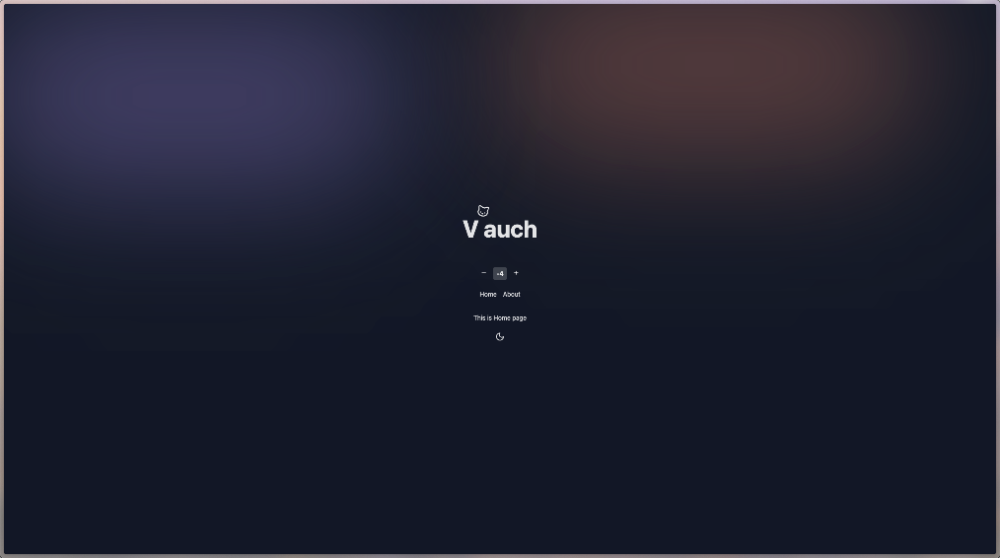

# Vauch

A modern Vue 3 starter template with batteries included

## Preview



## Motivation

This project was created to:

1. Streamline Vue development workflow
2. Provide a robust, production-ready project structure
3. Enforce Git commit conventions

## Features ✨

- 📁 File-based routing
- 🔄 Auto-import components
- 📡 Auto-import APIs
- 🛠️ Development tools included
- 📝 Full TypeScript support
- 🚀 Zero-config Vercel deployment

## Tech Stack 🛠

### Core

- [Vue 3](https://v3.vuejs.org/) - The Progressive JavaScript Framework
- [Vite](https://vitejs.dev/) - Next Generation Frontend Tooling

### Pre-packed

- [Tailwind CSS](https://tailwindcss.com/) - A utility-first CSS framework
- [Vue Router](https://router.vuejs.org/) - Official Router for Vue.js
- [Pinia](https://pinia.vuejs.org/) - Intuitive Vue.js State Management
- [VueUse](https://vueuse.org/) - Collection of Vue Composition Utilities
- [Vitest](https://vitest.dev/) - Vite-native Testing Framework

## Getting Started 🚀

### Installation

```bash
pnpm install
```

### Development

Run the following command and visit http://localhost:9527

```bash
pnpm dev
```

### Build

```bash
pnpm build
```

The built files will be generated in the `dist` directory, ready for deployment.
